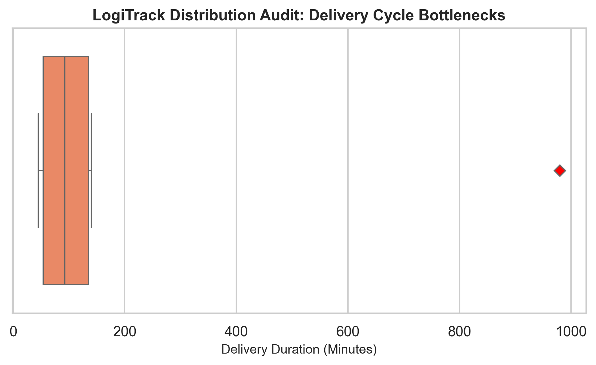

# LogiTrack-Automated: End-to-End Supply Chain ETL & Analytics Pipeline

## Business Overview
In large-scale logistics frameworks, raw operational tracking data is frequently fragmented across siloed relational schemas. These datasets often contain corrupted payloads, missing parameters, and extreme runtime anomalies. If left unaddressed, traditional mathematical summary metrics (like the Mean) become heavily distorted, leading to skewed operational forecasting and costly resource allocation.

**LogiTrack-Automated** addresses this risk by deploying a modular, full-stack Python ETL (Extract, Transform, Load) pipeline. The system builds a relational database infrastructure, safely sanitizes data anomalies using robust statistical methods, and automatically exports executive-ready diagnostic dashboards to isolate critical supply chain bottlenecks.

---

## System Architecture
The project is built using a decoupled, production-grade modular architecture:
1. **Data Infrastructure Layer (`build_db.py`):** Instantiates a relational SQLite engine, creating structured transaction schemas and primary master catalogs enforced by relational foreign keys.
2. **ETL Automation Layer (`pipeline.py`):** Establishes an integrated network pipeline executing optimized relational SQL `INNER JOIN` queries. It pipes data directly into Pandas and utilizes robust median imputation to process missing data without introducing statistical bias.
3. **Diagnostic Visualization Layer (`dashboard.py`):** An automated headless reporting module using Matplotlib and Seaborn to audit data distributions and securely save high-resolution graphics to disk.

---

## Analytical Insights & Performance Audit
By leveraging a horizontal distribution audit rather than a flat mathematical average, the pipeline successfully protected core performance indicators from being warped by data anomalies. 

### Key Operational Discovery:
* **The Baseline:** The middle 50% of our shipment network functions with extreme consistency, maintaining an operational execution window between **50 and 135 minutes**, with a true **median processing time of 95 minutes**.
* **The Bottleneck:** The pipeline isolated a severe operational outlier peaking at **980 minutes (nearly 16 hours)** under a specific driver assignment at the Dammam Hub. 

### Executive Visualization:
Below is the diagnostic box plot automatically generated and saved by the headless server pipeline, visually isolating the critical bottleneck (indicated by the red diamond) from standard operational baselines:



* **Operational Recommendation:** Rather than adjusting baseline budgets across the board based on skewed average shifts, resources should be targeted directly to a root-cause analysis of the Dammam Hub log to investigate mechanical or customs blockages.

---

## How To Run the Pipeline

### 1. Prerequisites & Dependencies
Ensure you have Python installed along with the required enterprise analytics libraries:
```bash
pip install pandas seaborn matplotlib
2. Execution Sequence
Run the modules sequentially from your terminal workspace:

Step 1: Build and Populate the Database

Bash
python src/build_db.py
Generates the local relational SQL engine (logistics.db).

Step 2: Run the ETL Pipeline Verification

Bash
python src/pipeline.py
Extracts, cleanses, and displays the processed matrix directly in the console environment.

Step 3: Generate and Export the Executive Dashboard

Bash
python src/dashboard.py
Executes the headless rendering sequence and outputs delivery_bottlenecks.png to disk.